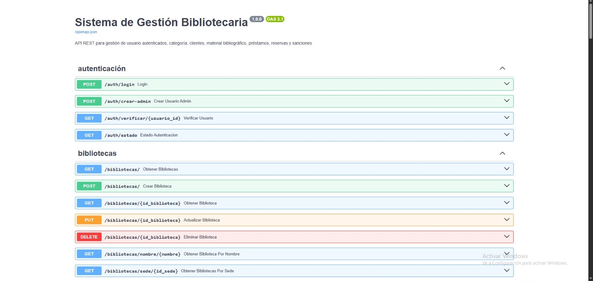

# Sistema de Gestión Bibliotecaria — Backend

API REST para la gestión de una red de bibliotecas, desarrollada en **Python** con **FastAPI** y **SQLAlchemy**. Permite administrar sedes, bibliotecas, clientes, materiales bibliográficos, préstamos, reservas y sanciones.

## 🌐 Aplicación publicada

> **URL:** [https://gestion-bibliotecaria-backend.onrender.com](https://gestion-bibliotecaria-backend.onrender.com)

> **Swagger UI:** [https://gestion-bibliotecaria-backend.onrender.com/docs](https://gestion-bibliotecaria-backend.onrender.com/docs)



---

## Tecnologías

- **Python 3.10+**
- **FastAPI** — framework web para la API REST
- **SQLAlchemy** — ORM para manejo de base de datos
- **Alembic** — migraciones de base de datos
- **Neon** — base de datos PostgreSQL en la nube
- **Uvicorn** — servidor ASGI
- **Pydantic** — validación de datos

---

## Estructura del proyecto

```
Gestion-Bibliotecario-Backend/
│
├── main.py                        # Punto de entrada de la API
│
├── apis/                          # Rutas y endpoints REST
│   ├── auth.py
│   ├── Biblioteca.py
│   ├── Categoria.py
│   ├── Cliente.py
│   ├── Material_Bibliografico.py
│   ├── Prestamo.py
│   ├── Reserva.py
│   ├── Sancion.py
│   ├── Sede.py
│   └── Usuario.py
│
├── crud/                          # Lógica de acceso a datos
│   ├── Biblioteca_crud.py
│   ├── Categoria_crud.py
│   ├── Cliente_crud.py
│   ├── Material_Bibliografico_crud.py
│   ├── Prestamo_crud.py
│   ├── Reserva_crud.py
│   ├── Sancion_crud.py
│   ├── Sede_crud.py
│   └── Usuario_crud.py
│
├── entities/                      # Modelos ORM (tablas de la BD)
│   ├── Biblioteca.py
│   ├── Categoria.py
│   ├── Cliente.py
│   ├── Material_Bibliografico.py
│   ├── Prestamo.py
│   ├── Reserva.py
│   ├── Sancion.py
│   ├── Sede.py
│   └── Usuario.py
│
├── database/
│   └── config.py                  # Configuración de la conexión a la BD
│
├── auth/
│   └── security.py                # Manejo de contraseñas y autenticación
│
├── Clases/                        # Versión de escritorio del sistema (tkinter)
│   └── main.py
│
├── .env                           # Variables de entorno (no subir al repo)
├── .gitignore
├── alembic.ini
└── requirements.txt
```

---

## Instalación y ejecución

### 1. Clona el repositorio

```bash
git clone <URL-del-repositorio>
cd Gestion-Bibliotecario-Backend
```

### 2. Crea y activa un entorno virtual

```bash
python -m venv venv

# Windows
venv\Scripts\activate

# macOS / Linux
source venv/bin/activate
```

### 3. Instala las dependencias

```bash
pip install -r requirements.txt
```

### 4. Configura las variables de entorno

Crea un archivo `.env` en la raíz del proyecto con el siguiente contenido:

```env
DATABASE_URL=postgresql://<usuario>:<contraseña>@<host>/<nombre_bd>?sslmode=require
```

> El proyecto usa **Neon** como base de datos PostgreSQL en la nube. Puedes crear una instancia gratuita en [neon.tech](https://neon.tech).

### 5. Ejecuta la API

```bash
uvicorn main:app --reload
```

---

## Endpoints disponibles

| Módulo                  | Prefijo                   |
|------------------------|---------------------------|
| Autenticación          | `/auth`                   |
| Bibliotecas            | `/bibliotecas`            |
| Categorías             | `/categorias`             |
| Clientes               | `/clientes`               |
| Materiales bibliográficos | `/materiales-bibliograficos` |
| Préstamos              | `/prestamos`              |
| Reservas               | `/reservas`               |
| Sanciones              | `/sanciones`              |
| Sedes                  | `/sedes`                  |
| Usuarios               | `/usuarios`               |

Documentación interactiva disponible en:
- Swagger UI: `http://127.0.0.1:8000/docs`
- ReDoc: `http://127.0.0.1:8000/redoc`

---

## Autores

Proyecto académico desarrollado en Python con FastAPI, SQLAlchemy y Neon por:
- **María Fernanda Palacio**
- **Salomé Gil**

*ITM — 2025*